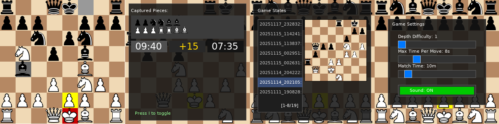

[](https://github.com/hpsaturn/chessboard/actions/workflows/build.yml)

# GNUChess Frontend

C++ chessboard renderer with SDL2, ASCII, and NCurses on the top of GNUChess UCI server protocol.


## Features

- [x] **SDL2 Mode**: Graphical chessboard with smooth rendering (default)
- [x] **GNUChess UCI**: protocol integration
- [x] **Bitboard validations**: improvement using bit arrays of 64 bits
- [x] **Picocalc Luckfox Lyra**: Optimized for this mod and board
- [x] **FEN notation support**: Basic game state loader via CLI argument
- [x] **Fast game states**: Save and load bookmarks with small preview
- [ ] **NCurses Mode**: Terminal UI with keyboard navigation (in progress)
- [ ] **Cross-platform**: Works on Linux, Windows, and macOS
- [ ] **ASCII Mode**: Terminal interface with Unicode pieces (inprogress)

## Requirements

### Build Dependencies

- GNUChess
- CMake (>= 3.10)
- C++11 compatible compiler
- SDL2 development libraries (ttf and image dev libraries)
- Yaml cpp library
- NCurses development libraries (optional, for interactive terminal mode)

## Installation

### Linux (Ubuntu/Debian)

```bash
# Install development libraries
sudo apt update
sudo apt install gnuchess cmake build-essential libsdl2-dev libsdl2-ttf-dev libsdl2-image-dev libncurses-dev libyaml-cpp-dev

# Build the project
./build.sh

# Test local execution:
./chess

# Install
cd build && sudo make install
```

### Picocalc (Luckfox Lyra Linux)

You need first change your original Picocalc RP2040 board, with a [LuckFox Lyra board](https://www.luckfox.com/Luckfox-Lyra), put a clean SD and follow the next steps:

```bash
git clone --recursive https://github.com/hpsaturn/picocalc-luckfox-lyra.git
cd picocalc-luckfox-lyra
./setup.sh
./build.sh all
./build.sh buildroot-make:gnuchess
./build.sh buildroot-make:chessboard
./flash.sh
```

For details please visit the follow links:

[Easy Linux build for LuckFox Lyra using Docker](https://github.com/hpsaturn/picocalc-luckfox-lyra?tab=readme-ov-file#picocalc-lyra-build-system)  
[Luckfox Lyra on Picocalc](https://forum.clockworkpi.com/t/luckfox-lyra-on-picocalc/)

### Precompiled binaries (Linux)

I precompiled some versions regulary in [releases](https://github.com/hpsaturn/chessboard/releases)

## Usage

This version is optimized for Picocalc board using Luckfox Lyra. For that it has the next key bindings:

| Key | Action |
|:-------:|-------|
| **Arrows** | Piece and setting selections |
| **SPACE** | Select piece or setting |
| **ENTER** | Move selected piece |
| **ESC** | Deselect piece or window exit |
| **F1**| Show keyboard bindings |
| **F2**| Save game state |
| **F3**| Load last game state saved |
| **F4**| Enter to game states window |
| **BACKSPACE** | Delete game state (states window) |
| **F5**| About and credits |
| **S**| Enter to settings section |
| **I**| Toggle to show game info |
| **Q**| Exit the game. (without state save for now) |
| **R**| Restart the game. (without ask before for now) |
| **H**| Help - Keyboard bindings |



### CLI

Also via command line is possible load a FEN state like this:

```bash
chess --fen "r3kb1r/ppp1pppp/5n2/8/1q4P1/3b1P2/PP1N3P/R1BQK2R b - - 0 1"
```

For more about FEN notation and details, please enter [here](https://www.redhotpawn.com/chess/chess-fen-viewer.php)

### Ncurses/Chars Board Piece Notation

| Piece | ASCII | NCurses | Description |
|-------|-------|---------|-------------|
| ♔ ♚ | K k | K k | King |
| ♕ ♛ | Q q | Q q | Queen |
| ♗ ♝ | B b | B b | Bishop |
| ♘ ♞ | N n | N n | Knight |
| ♖ ♜ | R r | R r | Rook |
| ♙ ♟ | P p | P p | Pawn |

**Note**: Uppercase letters represent black pieces, lowercase represent white pieces.

## TODO

- [x] Framebuffer support for Luckfox Lyra basic Linux buildroot image
- [x] Adapter class for join with GNU-Chess using UCI protocol
- [x] Picocalc keyboard issues (fixed)
- [x] Dead pieces count in each side (Game info window)
- [x] Basic settings modal window
- [x] Castelling full validations
- [x] Ilegal check moves validations (engine crashes)
- [x] isInCheck() validations
- [x] Help info modal window
- [x] Game info modal window (in porgress)
- [x] Points from the user (positive/negative)
- [x] Basic Timers
- [x] Buildroot config files for Luckfox Lyra tests
- [x] FEN casteling support
- [ ] Improve easy mode (seems that is not working)
- [ ] Flip board
- [ ] Sound support
- [ ] Sprite pieces improvement

<a href="https://youtu.be/ltv3fyuKk2g?si=Ese5JhjE1rsCQBCR" target="_blank"></a>

## Contributing

1. Fork the repository
2. Create a feature branch
3. Make your changes
4. Submit a pull request

## Credits

- Special thanks to my son, M.V for its continuous critics and beta tests
- Thanks to [@lunokjod](https://github.com/lunokjod) for his MongoIA assistant
- Thanks to [Chess SDL project](https://gitlab.com/fortysixandtwo/SDL-Chess) for its CC by SA image assets.

## License

This project is GPLv3. Some assets they are licensed under CC BY-SA 3.0. See assets directory for details.
