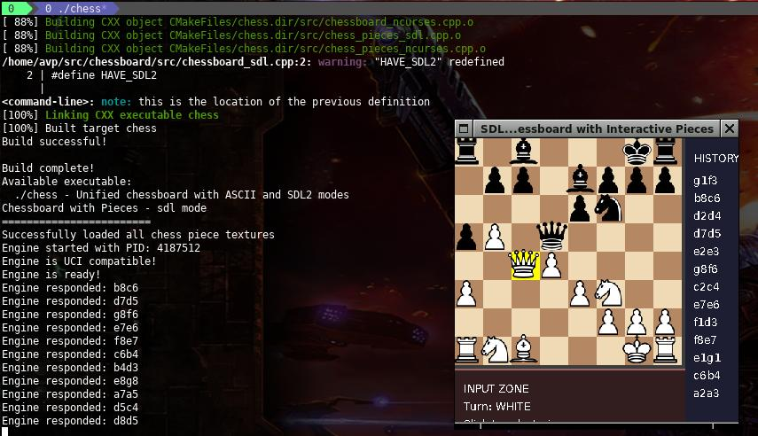

[](https://github.com/hpsaturn/chessboard/actions/workflows/build.yml)

# GNUChess Frontend

C++ chessboard renderer with SDL2, ASCII, and NCurses on the top of GNUChess UCI server protocol.

## Features

- [x] **SDL2 Mode**: Graphical chessboard with smooth rendering (default)
- [x] **GNUChess UCI**: protocol integration
- [x] **Unified Binary**: Single executable with command-line options
- [x] **Cross-platform**: Works on Linux, Windows, and macOS
- [x] **Picocalc Luckfox Lyra**: SDL and keyboard issues are fixed 
- [ ] **NCurses Mode**: Terminal interface with keyboard navigation (in progress)
- [ ] **ASCII Mode**: Terminal interface with Unicode pieces (inprogress)

## Requirements

### Build Dependencies

- GNUChess
- CMake (>= 3.10)
- C++11 compatible compiler
- SDL2 development libraries (ttf and image dev libraries)
- NCurses development libraries (optional, for interactive terminal mode)

### Runtime Dependencies

- SDL2 runtime libraries (for graphical mode)
- NCurses runtime libraries (for interactive terminal mode)

## Installation

### Linux (Ubuntu/Debian)

```bash
# Install development libraries
sudo apt update
sudo apt install gnuchess cmake build-essential libsdl2-dev libsdl2-ttf-dev libsdl2-image-dev libncurses-dev

# Build the project
./build.sh

# Run SLD2 mode:
./chess
```



## TODO

- [x] Framebuffer support for Luckfox Lyra basic Linux buildroot image
- [x] Adapter class for join with GNU-Chess using UCI protocol
- [x] Picocalc keyboard issues (fixed)
- [ ] Castelling full validations
- [x] Dead pieces count in each side (Game info window)
- [ ] Points from the user (positive/negative)
- [x] Settings modal window
- [ ] Game info modal window (in porgress)
- [ ] Chronometers
- [ ] Help info modal window
- [ ] Buildroot config files for Luckfox Lyra tests
- [ ] Sprite pieces improvement

## Usage

This version is optimized for Picocalc board using Luckfox Lyra. For that it has the next key bindings:

| Key | Action |
|:-------:|-------|
| **Arrows** | Piece and setting selections |
| **SPACE** | Select piece or setting |
| **ENTER** | Move selected piece |
| **ESC** | Deselect piece or window exit |
| **S**| Enter to settings section |
| **I**| Enter to game info |
| **Q**| Exit the game. (without state save for now) |
| **R**| Restart the game. (without ask before for now) |
| **H**| Help (in progress) |

### Ncurses/Chars Board Piece Notation

| Piece | ASCII | NCurses | Description |
|-------|-------|---------|-------------|
| ♔ ♚ | K k | K k | King |
| ♕ ♛ | Q q | Q q | Queen |
| ♗ ♝ | B b | B b | Bishop |
| ♘ ♞ | N n | N n | Knight |
| ♖ ♜ | R r | R r | Rook |
| ♙ ♟ | P p | P p | Pawn |

**Note**: Uppercase letters represent black pieces, lowercase represent white pieces.

## Contributing

1. Fork the repository
2. Create a feature branch
3. Make your changes
4. Test all modes (ASCII, SDL2, NCurses)
5. Submit a pull request

## Credits

- Thanks to [@lunokjod](https://github.com/lunokjod) for his MongoIA assistant
- Thanks to [Chess SDL project](https://gitlab.com/fortysixandtwo/SDL-Chess) for its CC by SA image assets.

## License

This project is GPLv3. Some assets they are licensed under CC BY-SA 3.0. See assets directory for details.
